# Sumário

1. [Introdução](#introdução)  
2. [Licença](#licença)  
3. [Instalação](#instalação)  
   - [macOS](#instalação-no-macos)  
   - [Windows](#instalação-no-windows)  
   - [Linux](#instalação-no-linux)  
4. [Compilação do Documento](#compilação-do-documento)  
5. [Inicialização e Opções](#inicialização-e-opções)  
6. [Tipos de Saída](#tipos-de-saída)  
7. [Capotraste](#capotraste)  
8. [Caixas de Título](#caixas-de-título)  
9. [Estrutura de Músicas](#estrutura-de-músicas)  
   - [Ambiente `songs`](#ambiente-songs)  
   - [Comando `\beginsong`](#comando-beginsong)  
   - [Versos e Refrões](#versos-e-refrões)  
   - [Acordes](#acordes)  
   - [Repetição de Acordes](#repetição-de-acordes)  
   - [Bemol & Sustenido](#bemol--sustenido)  
   - [Mais Exemplos com Acordes](#mais-exemplos-com-acordes)  
   - [Eco e Repetições](#eco-e-repetições)  
10. [Diagrama de Acordes](#diagrama-de-acordes)  

---

# Introdução

Esta documentação foi criada de forma independente e pode não abordar todos os tópicos ou recursos disponíveis. Para obter informações completas e atualizadas, consulte a [Documentação Oficial](https://songs.sourceforge.net/songs.pdf).

---

# Licença

O pacote [songs](https://songs.sourceforge.net/index.html) é distribuído sob a **GNU General Public License v2**. Você pode redistribuí-lo e/ou modificá-lo conforme necessário, desde que siga os termos da licença.

---

# Instalação

A instalação do pacote LaTeX `songs` pode ser feita em sistemas operacionais como macOS, Windows e Linux. Abaixo estão as instruções detalhadas para cada plataforma.

## Instalação no macOS

### Instale uma distribuição LaTeX

No macOS, a distribuição LaTeX mais comum é o [MacTeX](https://www.tug.org/mactex/). Siga os passos abaixo:

1. Vá para o site oficial do MacTeX: [https://www.tug.org/mactex/](https://www.tug.org/mactex/).
2. Baixe o instalador do MacTeX.
3. Execute o instalador e siga as instruções na tela.
4. Abra o **TeX Live Utility** (você pode encontrá-lo no diretório Applications/TeX).
5. No menu superior, clique em **Packages**/**Search**.
6. Digite `songs` na barra de pesquisa.
7. Clique com o botão direito no pacote `songs` e selecione **Install**.

## Instalação no Windows

### Instale uma distribuição LaTeX

No Windows, a distribuição LaTeX mais usada é o [MiKTeX](https://miktex.org/).

1. Vá para o site oficial do MiKTeX: [https://miktex.org/download](https://miktex.org/download).
2. Baixe o instalador adequado para o seu sistema (32-bit ou 64-bit).
3. Execute o instalador e siga as instruções na tela. Durante a instalação, escolha a opção **Install missing packages on the fly** para facilitar a instalação de pacotes adicionais.
4. Abra o **MiKTeX Console** (você pode encontrá-lo no menu Iniciar).
5. Vá para a aba **Packages**.
6. Na barra de pesquisa, digite `songs`.
7. Clique no pacote `songs` e selecione **Install**.

## Instalação no Linux

### Instale uma distribuição LaTeX

No Linux, a distribuição LaTeX mais comum é o TeX Live. Você pode instalá-la via gerenciador de pacotes do seu sistema:

- **Ubuntu/Debian**:
  
  ```bash
  sudo apt update
  sudo apt install texlive-full
  ```
  
  O pacote `texlive-full` inclui todos os pacotes LaTeX disponíveis, incluindo o `songs`.

- **Fedora**: 
  
  ```bash
  sudo dnf install texlive-scheme-full
  ```

- **Arch Linux**:
  
  ```bash
  sudo pacman -S texlive-most
  ```

- **Instale o pacote `songs` (se necessário)**
  Se você instalou apenas o TeX Live básico (não `texlive-full`), pode instalar o pacote `songs` manualmente usando o comando `tlmgr` (TeX Live Manager):
  
  ```bash
  sudo tlmgr install songs
  ```

---

# Compilação do Documento

**Exemplo:**

```latex
\documentclass{article}
\usepackage[chorded]{songs}

\begin{document}

\begin{songs}{}

\beginsong{Título da música}[
  by={Artista ou Autor},
  sr={João 3:16},
  cr={Domínio público}] 

\beginverse
\[Dm7]Letra \[G7]de uma \[Cmaj7]música. \\
\endverse 

\endsong 

\end{songs} 

\end{document}
```

Use o compilador `pdflatex` para gerar o PDF:

```bash
pdflatex meu_documento.tex
```

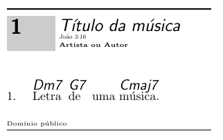

---

# Inicialização e Opções

O pacote `songs` oferece várias opções para personalizar o tipo de livro de músicas que será gerado. Essas opções são especificadas no comando `\usepackage` no preâmbulo do documento LaTeX.

```latex
\usepackage[]{songs}
```

---

# Tipos de Saída

O pacote pode produzir quatro tipos principais de livros:

1. **Livros de Letras (`lyric`)**: Exibem apenas as letras das músicas, omitindo os acordes.
   
   ```latex
   \usepackage[lyrics]{songs}
   ```

2. **Livros de Acordes (`chorded`)**: Incluem tanto as letras quanto os acordes, além de informações adicionais para músicos (como notas musicais).
   
   ```latex
   \usepackage[chorded]{songs}
   ```

3. **Slides para Projeção (`slides`)**: Formata as músicas em slides grandes, centralizados, uma música por página, adequados para projeção em cultos ou eventos.
   
   ```latex
   \usepackage[slides]{songs}
   ```

4. **Texto Simples (`rawtext`)**: Gera um arquivo de texto simples contendo apenas as letras das músicas, sem acordes.
   
   ```latex
   \usepackage[rawtext]{songs}
   ```

Por padrão, se nenhuma opção for especificada, o pacote gera um **livro de acordes** (`chorded`). As opções `slides` e `chorded` podem ser combinadas para criar slides com acordes.

---

# Capotraste

O comportamento do comando `\capo`. Normalmente, `\capo{n}` sugere o uso de um capo no traste `n` para guitarristas.

```latex
\beginsong{Título da música}[
  by={Artista ou Autor},
  sr={João 3:16},
  cr={Domínio público}] 

\capo{1}

\beginverse
\[Dm7]Letra \[G7]de uma \[Cmaj7]música. \\
\endverse 

\endsong
```

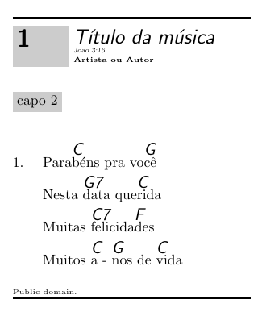

- Com a opção `transposecapos` ativada, os acordes são transpostos automaticamente para cima em `n` semitons, o que pode ser útil para adaptar o livro para pianistas.

```latex
\usepackage[chorded,transposecapos]{songs}
```

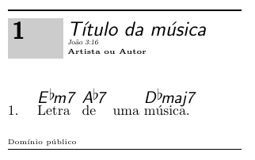

---

# Caixas de Título

- A opção `noshading` remove todas as caixas sombreadas, como aquelas ao redor dos números das músicas ou notas textuais. Isso pode ser útil se essas caixas causarem problemas de impressão ou consumirem muita tinta.

```latex
\usepackage[chorded,noshading]{songs}
```

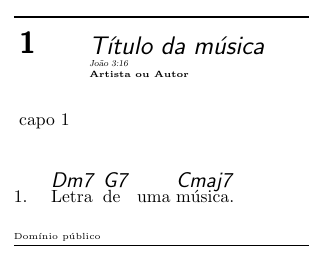

---

# Estrutura de Músicas

## Ambiente `songs`

As músicas devem ser colocadas dentro de um ambiente `songs`, que é definido por:

```latex
\begin{songs}{ }
...
\end{songs}
```

## Comando `\beginsong`

Define o início de uma música. A sintaxe básica é:

```latex
\beginsong{ }[ ]
```

- ` `: Um ou mais títulos da música, separados por `\\`. O primeiro título é exibido normalmente, enquanto os demais aparecem entre parênteses.
- `[ ]`: Informações adicionais sobre a música, como autores (`by`), direitos autorais (`cr`), licenças (`li`), referências bíblicas (`sr`), etc.

```latex
\beginsong{Título \\ Subtítulo}[
    by={Autor, Artista, ou Compositor},
    cr={\copyright~2025},
    li={licença},
    sr={Referência bíblica}]
```

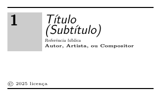

## Versos e Refrões

- **Versos**: São criados com os comandos `\beginverse` e `\endverse`. Por padrão, os versos são numerados, mas você pode criar versos não numerados usando `\beginverse*` (útil para introduções, pré-refrões, pontes, finais...).
- **Refrões**: São criados com os comandos `\beginchorus` e `\endchorus`. Refrões têm uma linha vertical à esquerda para distingui-los dos versos.

Exemplo:

```latex
\beginverse
Letra do verso aqui. \\
Letra do verso aqui. \\
\endverse

\beginverse
Letra do verso aqui. \\
Letra do verso aqui. \\
\endverse

\beginverse*
Letra do pré-refrão aqui. \\
Letra do pré-refrão aqui. \\
\endverse

\beginchorus
Letra do refrão aqui. \\
Letra do refrão aqui. \\
\endchorus
```

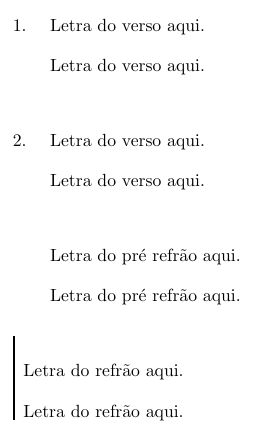

## Acordes

- **Sintaxe dos acordes**: Os acordes são inseridos com o comando `\[ ]`. Eles só aparecem em livros de acordes (`chorded`) e são omitidos em livros de letras (`lyric`).
- **Texto sob acordes**: Qualquer texto imediatamente após o acorde (sem espaço) será posicionado diretamente abaixo dele. Espaços ou quebras de linha indicam que o acorde deve ser tocado entre palavras.

```latex
\[G]Letra \[C]da \[G]música. \\
```

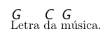

---

# Repetição de Acordes

Para evitar repetir acordes em versos subsequentes, use o símbolo `^` no lugar do acorde. O pacote automaticamente reproduzirá o acorde correspondente do primeiro verso.

```latex
\beginverse
\[G]Pri\[Em]meiro \[C]ver\[D]so. \\
\endverse

\beginverse
^Segundo verso ^com \\
Os ^mesmos acor^des. \\
\endverse
```

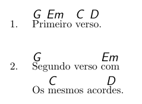

---

# Bemol & Sustenido

O pacote `songs` define macros específicas para inserir sustenidos e bemois em acordes:

- Sustenido `(♯)`: Use o caractere `#` ou a macro `\shrp`.
- Bemol `(♭)`: Use o caractere `&` ou a macro `\flt`.

Esses símbolos podem ser usados diretamente dentro dos comandos de acordes, como `\[]`. Por exemplo:

```latex
\[G\shrp] ou \[G#] \\
\[A\flt] ou \[A&] \\
```

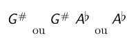

---

# Mais Exemplos com Acordes

```latex
\[E&]paz e \[Am]alegria \\
```

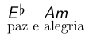

---

# Eco e Repetições

Comando `\echo{ }`:

- Usado para criar partes de eco, que são tipicamente usadas em músicas onde uma frase é repetida por um grupo (como um coro) após ser cantada por um solista.
- As partes de eco são formatadas entre parênteses e em itálico para distingui-las visualmente no texto.

```latex
Alle\[G]luia! \echo{Alle\[A]luia!} \\
```

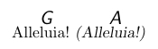

Comando `\rep{ }`:

- Usado para indicar que uma linha deve ser repetida um certo número de vezes (` `) por todos os cantores.
- O número de repetições é exibido entre parênteses após a linha, com o símbolo "`×`" seguido pelo número.

```latex
Alle\[G]lui\[D]a! \rep{4} \\
```

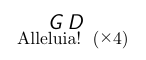

---

# Diagrama de Acordes

O comando principal para criar diagramas de tablatura é `\gtab`. Ele tem a seguinte sintaxe:

```latex
\gtab{ }{ : : }
```

- **` `**: O nome do acorde que será exibido acima do diagrama.
- **` `**: (Opcional) Um número que indica o traste inicial do diagrama (por exemplo, "2" para começar no segundo traste).
- **` `**: Uma sequência de símbolos que descreve como cada corda deve ser tocada:
  - `X`: A corda não deve ser tocada.
  - `0` ou `O`: A corda deve ser tocada aberta (sem pressionar nenhum traste).
  - Números (`1` a `9`): Indicam o traste onde a corda deve ser pressionada.
- **` `**: (Opcional) Informações sobre qual dedo usar para pressionar cada corda.

```latex
\gtab{A}{}
```

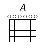