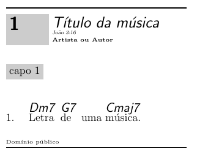
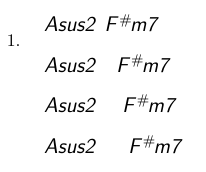
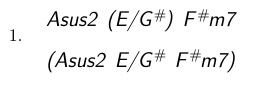

# Licença

O pacote [songs](https://songs.sourceforge.net/docs.html) é distribuído sob a **GNU General Public License v2**. Você pode redistribuí-lo e/ou modificá-lo conforme necessário, desde que siga os termos da licença.

# Instalação

A instalação do pacote LaTeX `songs` pode ser feita em sistemas operacionais como macOS, Windows e Linux. 

## Instalação no macOS

### Instale uma distribuição LaTeX

No macOS, a distribuição LaTeX mais comum é o [MacTeX](https://www.tug.org/mactex/). Siga os passos abaixo:

1. Vá para o site oficial do MacTeX: [https://www.tug.org/mactex/](https://www.tug.org/mactex/).
2. Baixe o instalador do MacTeX.
3. Execute o instalador e siga as instruções na tela.
4. Abra o **TeX Live Utility** (você pode encontrá-lo no diretório Applications/TeX).
5. No menu superior, clique em **Packages**/**Search**.
6. Digite `songs` na barra de pesquisa.
7. Clique com o botão direito no pacote `songs` e selecione **Install**.

## Instalação no Windows

### Instale uma distribuição LaTeX

No Windows, a distribuição LaTeX mais usada é o [MiKTeX](https://miktex.org/).

1. Vá para o site oficial do MiKTeX: [https://miktex.org/download](https://miktex.org/download).
2. Baixe o instalador adequado para o seu sistema (32-bit ou 64-bit).
3. Execute o instalador e siga as instruções na tela. Durante a instalação, escolha a opção **Install missing packages on the fly** para facilitar a instalação de pacotes adicionais.
4. Abra o **MiKTeX Console** (você pode encontrá-lo no menu Iniciar).
5. Vá para a aba **Packages**.
6. Na barra de pesquisa, digite `songs`.
7. Clique no pacote `songs` e selecione **Install**.

## Instalação no Linux

### Instale uma distribuição LaTeX

No Linux, a distribuição LaTeX mais comum é o TeX Live. Você pode instalá-la via gerenciador de pacotes do seu sistema:

- **Ubuntu/Debian**:
  
  ```bash
  sudo apt update
  sudo apt install texlive-full
  ```
  
  O pacote `texlive-full` inclui todos os pacotes LaTeX disponíveis, incluindo o `songs`.

- **Fedora**:
  
  ```bash
  sudo dnf install texlive-scheme-full
  ```

- **Arch Linux**:
  
  ```bash
  sudo pacman -S texlive-most
  ```

- **Instale o pacote `songs` (se necessário)**
  Se você instalou apenas o TeX Live básico (não `texlive-full`), pode instalar o pacote `songs` manualmente usando o comando `tlmgr` (TeX Live Manager):
  
  ```bash
  sudo tlmgr install songs
  ```

## Compilando o documento

**Exemplo:**

```latex
\documentclass{article}
\usepackage[chorded]{songs}

\begin{document}
	
\begin{songs}{}

\beginsong{Título da música}[
  by={Artista ou Autor},
  sr={João 3:16},
  cr={Domínio público}] 

\beginverse
\[Dm7]Letra \[G7]de uma \[Cmaj7]música. \\
\endverse 

\endsong 

\end{songs} 
	
\end{document}
```

Use o compilador `pdflatex` para gerar o PDF:

```bash
pdflatex meu_documento.tex
```


# Inicialização e Opções

O pacote `songs` oferece várias opções para personalizar o tipo de livro de músicas que será gerado. Essas opções são especificadas no comando `\usepackage` no preâmbulo do documento LaTeX.

```latex
\usepackage[<options>]{songs}
```

## Tipos de Saída

O pacote pode produzir quatro tipos principais de livros:

1. **Livros de Letras (`lyric`)** : Exibem apenas as letras das músicas, omitindo os acordes.
```latex
\usepackage[lyrics]{songs}
```
2. **Livros de Acordes (`chorded`)** : Incluem tanto as letras quanto os acordes, além de informações adicionais para músicos (como notas musicais).
```latex
\usepackage[chorded]{songs}
```
3. **Slides para Projeção (`slides`)** : Formata as músicas em slides grandes, centralizados, uma música por página, adequados para projeção em cultos ou eventos.
```latex
\usepackage[slides]{songs}
```
4. **Texto Simples (`rawtext`)** : Gera um arquivo de texto simples contendo apenas as letras das músicas, sem acordes.
```latex
\usepackage[rawtext]{songs}
```

Por padrão, se nenhuma opção for especificada, o pacote gera um **livro de acordes** (`chorded`). As opções `slides` e `chorded` podem ser combinadas para criar slides com acordes.

## Capotraste

O comportamento do comando `\capo`. Normalmente, `\capo{n}` sugere o uso de um capo no traste `n` para guitarristas. 

```latex
\beginsong{Título da música}[
  by={Artista ou Autor},
  sr={João 3:16},
  cr={Domínio público}] 

\capo{1}

\beginverse
\[Dm7]Letra \[G7]de uma \[Cmaj7]música. \\
\endverse 

\endsong
```



- Com a opção `transposecapos` ativada, os acordes são transpostos automaticamente para cima em `n` semitons, o que pode ser útil para adaptar o livro para pianistas.

```latex
\usepackage[chorded,transposecapos]{songs}
```


## Caixas de Título

- A opção `noshading` remove todas as caixas sombreadas, como aquelas ao redor dos números das músicas ou notas textuais. Isso pode ser útil se essas caixas causarem problemas de impressão ou consumirem muita tinta.

```latex
\usepackage[chorded,noshading]{songs}
```


# Música

- **Ambiente `songs`** : As músicas devem ser colocadas dentro de um ambiente `songs`, que é definido por:

```latex
\begin{songs}{<índice>}
...
\end{songs}
```

- **Comando `\beginsong`** : Define o início de uma música. A sintaxe básica é:

```latex
\beginsong{<títulos>}[<outras informações>]
```

- `〈títulos〉`: Um ou mais títulos da música, separados por `\\`. O primeiro título é exibido normalmente, enquanto os demais aparecem entre parênteses.
- `[<outras informações>]`: Informações adicionais sobre a música, como autores (`by`), direitos autorais (`cr`), licenças (`li`), referências bíblicas (`sr`), etc.

```latex
\beginsong{Título \\ Subtítulo}[
	by={Autor, Artista, ou Compositor},
	cr={\copyright~2025},
	li={licença},
	sr={Referência bíblica}]
```


## Versos e Refrões

- **Versos** : São criados com os comandos `\beginverse` e `\endverse`. Por padrão, os versos são numerados, mas você pode criar versos não numerados usando `\beginverse*`.
- **Refrões** : São criados com os comandos `\beginchorus` e `\endchorus`. Refrões têm uma linha vertical à esquerda para distingui-los dos versos.

Exemplo:

```latex
\beginverse
Letra do verso aqui. \\
Letra do verso aqui. \\
\endverse

\beginverse
Letra do verso aqui. \\
Letra do verso aqui. \\
\endverse

\beginchorus
Letra do refrão aqui. \\
Letra do refrão aqui. \\
\endchorus
```


## Acordes

- **Sintaxe dos acordes** : Os acordes são inseridos com o comando `\[<nome do acorde>]`. Eles só aparecem em livros de acordes (`chorded`) e são omitidos em livros de letras (`lyric`).
- **Texto sob acordes** : Qualquer texto imediatamente após o acorde (sem espaço) será posicionado diretamente abaixo dele. Espaços ou quebras de linha indicam que o acorde deve ser tocado entre palavras.

```latex
\[G]Letra \[C]da \[G]música. \\
```


- **Sequências de acordes** : Sequências de acordes podem ser escritas juntas ou separadas. Ambos os exemplos abaixo produzem o mesmo resultado:

```latex
\[A]\[B]\[Em]Música, músi\[C]ca. \\
\[A B Em]Música, músi\[C]ca. \\
```



### Repetição de Acordes

- **Repetição de acordes** : Para evitar repetir acordes em versos subsequentes, use o símbolo `^` no lugar do acorde. O pacote automaticamente reproduzirá o acorde correspondente do primeiro verso.

```latex
\beginverse
\[G]Pri\[Em]meiro \[C]ver\[D]so. \\
\endverse

\beginverse
^Segundo verso ^com \\
Os ^mesmos acor^des. \\
\endverse
```



# Contribuições

Se você deseja contribuir com melhorias ou correções, visite o repositório oficial no [SourceForge](https://songs.sourceforge.net/docs.html) ou entre em contato com o autor, [Kevin W. Hamlen](https://personal.utdallas.edu/~hamlen/).
